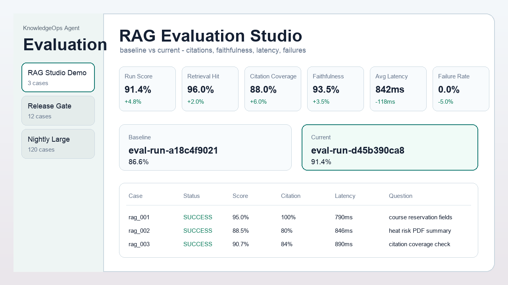
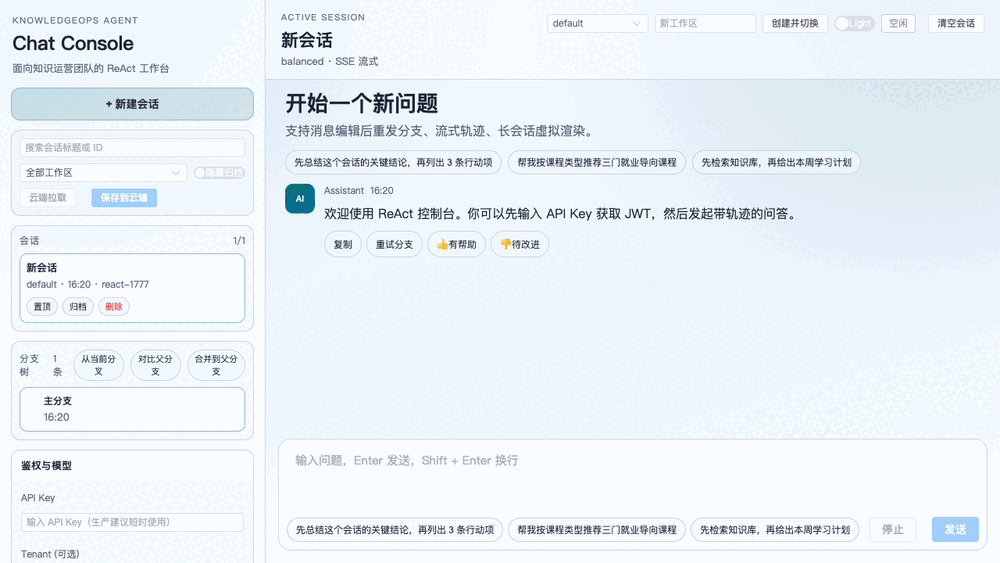
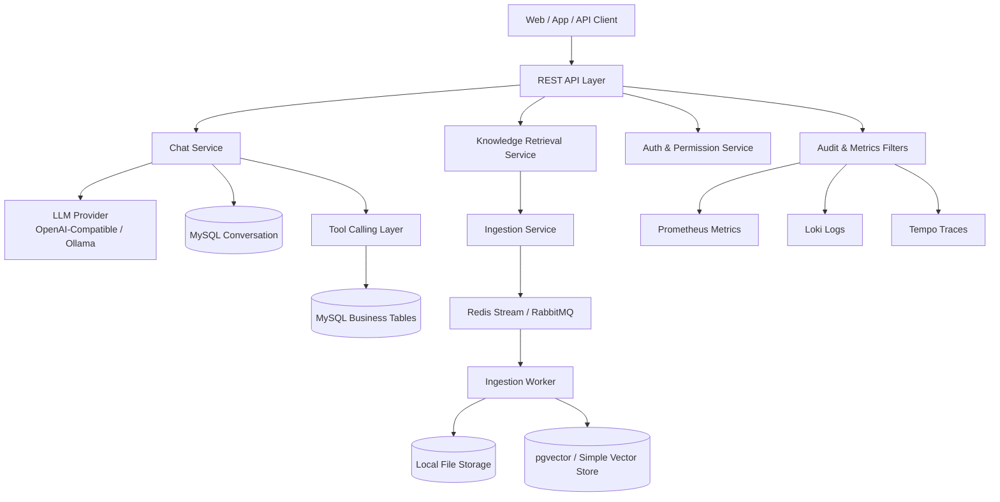

# KnowledgeOps Agent | 企业级 Spring AI RAG 平台 | 智能问答与知识运营平台

[](https://github.com/however-yir/knowledgeops-agent/actions/workflows/ci.yml)
[](https://github.com/however-yir/knowledgeops-agent/releases)
[](docs/index.md)
[](LICENSE)
[](https://github.com/however-yir/knowledgeops-agent/pkgs/container/knowledgeops-agent)
[](docs/spring-ai-upgrade-plan.md)

> **矩阵角色：** `knowledgeops-agent` 是平台基线：企业级 Spring AI RAG、Agent 工作流状态、记忆持久化基础能力、证据链、租户隔离、安全与可观测性。[`tianji-ai-agent`](https://github.com/however-yir/tianji-ai-agent) 等业务 Agent 构建在这一层之上。
>
> **Spring AI 基线：** 已运行在 `1.1.7` 稳定线（Maven Central）；从 `1.0.0-M6` 完成迁移的历史计划与 breaking changes 清单留档在 [docs/spring-ai-upgrade-plan.md](docs/spring-ai-upgrade-plan.md)。

KnowledgeOps Agent 是一个面向生产的平台原型，基于 Spring AI 构建。它整合了 **Agent 工作流引擎**、**混合检索（向量 + 关键词 + 图谱 + Web）**、**知识图谱**、**长短期记忆持久化**、**DeepResearch**、租户隔离的 RAG、异步 PDF 入库、JWT/API Key/RBAC 安全体系、审计追踪，以及 Prometheus/Loki/Tempo 可观测性。能力状态与默认路径的局限见下文。

> 基于 Spring AI 构建的多 Agent 企业知识平台原型：覆盖 **Agent 工作流引擎、混合检索（向量+关键词+图谱+Web）、知识图谱、长短期记忆持久化、深度研究、企业 RAG、租户隔离、异步入库、权限审计、全链路可观测**，目标是提供可部署、可运维、可验证的工程基线，而非未经生产验证的成品声明。





## 为什么它不止是一个 Demo

| 证明点 | 仓库证据 |
|---|---|
| 企业级 RAG | 文档上传（PDF / Word / Markdown）、异步入库任务、租户隔离检索、答案引用、证据片段 |
| 租户与权限边界 | API Key、JWT、Refresh Token 生命周期、RBAC 权限、租户请求头、审计日志 |
| 运维基线 | Docker Compose、Flyway 迁移、结构化日志、Prometheus 指标、Loki 日志、Tempo 链路追踪、Alertmanager 规则 |
| 质量证据 | RAG Evaluation Studio、单元测试、Testcontainers 集成测试、JaCoCo、回归评测、端到端 smoke 日志、Docker 镜像构建；另有框架无关的外部评测 [ragproof](https://github.com/however-yir/ragproof) |
| 可扩展的 AI 工作流 | Spring AI 对话、ReAct trace 载荷、SSE token 流式输出、模型路由、工具执行挂钩 |

## 产品功能面

| 功能面 | 检查内容 |
|---|---|
| 控制台工作区 | 会话分支、会话重命名、流式模式、模型档位、双引擎切换（ReAct / workflow）、用量统计、JWT/API Key 鉴权、租户上下文 |
| 知识库管理 | 文档清单与删除、多格式上传（PDF / Word / Markdown）、入库任务轮询、试搜（三路本地召回，不调模型） |
| Evaluation Studio | 评测数据集（可删，级联清理运行与结果）、基线与当前运行对比、检索/引用/忠实度指标、Markdown 报告导出 |
| RAG 问答 | 引用标签、证据片段、空结果兜底策略 |
| API 面 | Swagger UI、curl 示例、chat/RAG/ingestion/auth/audit 端点 |
| 运维面 | 健康检查、Prometheus 指标、端到端产物、回归报告、容器镜像 |


## 架构一览


## 5 分钟验证路径

```bash
git clone https://github.com/however-yir/knowledgeops-agent.git
cd knowledgeops-agent
./scripts/demo.sh
```

启动后：

- 前端控制台：`http://localhost:8088`
- 后端 API：`http://localhost:8080`
- Swagger UI：`http://localhost:8080/swagger-ui/index.html`
- 本地演示 API Key：查看 `.env.example` 中预置的开发值，或前端控制台中的「鉴权」卡片。

如果你使用 `make`，也可以改用 Make 目标：

```bash
make demo
make demo-verify
make eval-demo
make demo-down
```

## V1 三条演示路径（3-5 分钟/条）

| # | 路径 | 展示能力 | 文档 |
|---|---|---|---|
| 1 | **DeepResearch 行业研究** | 主题拆解→混合检索→证据评分→报告生成 | [demo-paths.md](docs/demo-paths.md#链路一deepresearch-行业研究) |
| 2 | **智能客服（tianji）** | 意图识别→9子Agent路由→工具调用→SSE卡片 | tianji [README](https://github.com/however-yir/tianji-ai-agent) |
| 3 | **知识库混合检索问答** | PDF入库→四路召回→证据评分→引用溯源 | [demo-paths.md](docs/demo-paths.md#链路三知识库问答混合检索--引用溯源) |

## 证据链接

- 文档索引：[docs/index.md](docs/index.md)
- 证据包：[docs/evidence/README.md](docs/evidence/README.md)
- 最新发布：[v1.0.0](https://github.com/however-yir/knowledgeops-agent/releases/tag/v1.0.0)
- 3 条演示路径: [docs/demo-paths.md](docs/demo-paths.md)
- 可复现 Demo 脚本：[docs/demo-script.md](docs/demo-script.md)
- 运维手册：[docs/operations.md](docs/operations.md)
- 企业架构：[docs/architecture-enterprise.md](docs/architecture-enterprise.md)

## 矩阵角色

KnowledgeOps Agent 是 however-yir AI 工程作品矩阵中的 **”多 Agent + RAG + 记忆 + 图谱的企业 AI 平台”**，作为 **tianji-ai-agent（智能客服/课程顾问）** 的能力底座。

| 项目 | 定位 | 关系 |
|---|---|---|
| **KnowledgeOps Agent** | 多 Agent + RAG + 记忆 + 图谱的企业 AI 平台 | 提供 RAG/记忆/图谱/DeepResearch API |
| **tianji-ai-agent** | CloudAgent 智能客服/课程顾问应用 | 调用 KnowledgeOps 平台能力 |

完整项目矩阵见 [docs/project-matrix.md](docs/project-matrix.md)。

---

## 目录

- 为什么它不止是一个 Demo
- 产品功能面
- 架构一览
- 5 分钟验证路径
- 证据链接
- 矩阵角色
- 项目定位
- 为什么选择 KnowledgeOps Agent？
- 企业级能力矩阵
- 技术栈与版本基线
- 架构总览
- 核心模块
- 快速开始
- 容器化部署
- 生产部署建议
- 环境变量与配置项
- API 概览
- 安全与权限体系
- 可观测与运维
- 测试与质量保障
- 性能与容量规划
- 文档索引
- 路线图

---

## 项目定位

本项目按"企业级 Spring AI RAG 平台"设计，不停留在单接口聊天示例，而是把知识入库、检索问答、租户与权限边界、审计可追溯、可观测运维、质量回归放在同一条可验证链路里。它适合作为企业知识库、智能客服、内部运营助手或 AI 平台工程基线继续扩展。

重点解决以下问题：

1. 如何把对话能力稳定落在业务流程中，而不是仅做单轮聊天。
2. 如何把 PDF/文档知识接入检索增强链路，并保证可追溯来源。
3. 如何让工具调用具备权限边界、审计记录和失败可恢复机制。
4. 如何实现线上可运维：日志、指标、链路追踪、告警、回归评测闭环。

适用场景：

- 智能客服与企业知识问答
- 内部知识库检索问答（文档上传、切片、向量化、检索）
- 需要 AI + 业务工具联合执行的流程型场景

---

## 为什么选择 KnowledgeOps Agent？

| 能力 | KnowledgeOps Agent | 典型 RAG demo | 典型 Spring AI 示例 |
|---|---|---|---|
| 可部署的完整技术栈 | Spring Boot API、Vue 控制台、MySQL、Redis/RabbitMQ、pgvector、Docker Compose | 通常只有 API 或 notebook 级别 | 通常只聚焦单个框架特性 |
| 租户感知的安全 | API Key、JWT、Refresh Token、RBAC、由认证身份派生的租户范围、审计日志、限流 | 很少包含 | 为清晰起见通常省略 |
| 异步入库 | Redis Stream 或 RabbitMQ 队列、重试、DLQ、幂等、任务状态 | 常为同步上传与解析 | 通常随示例而定 |
| RAG 生产化路径 | 租户隔离检索、引用、切片、重排器扩展点（默认恒等实现）、pgvector 索引 | 基础向量查询 | 演示核心 API 用法 |
| 可观测性 | Prometheus、Loki、Tempo、Alertmanager、结构化日志、运维手册 | 通常缺失 | 极少或依赖外部 |
| 质量门禁 | 全模块 JaCoCo 门禁、MySQL/Flyway 启动测试、评测器契约测试、真实 API 评测、k6 脚本 | 人工验证 | 因示例而异 |

---

## 企业级能力矩阵

| 能力域 | 当前实现 |
|---|---|
| 多Agent工作流 | AgentWorkflowEngine 状态机（CREATED→PLANNING→SEARCHING→RETRIEVING→JUDGING→REFLECTING→WRITING→DONE），agent_task/step/event 持久化与事件溯源 |
| DeepResearch 深度研究 | ResearchPlannerAgent（主题拆解）+ RagResearchAgent + ReportWriterAgent，异步受理（202 + taskId，后台池执行）并持久化 task/step/event，前端按 taskId 轮询；外部 Web 搜索默认关闭 |
| 混合检索 | VectorRetriever（pgvector）+ KeywordRetriever（关键词）+ GraphRetriever（知识图谱）+ WebRetriever（外部搜索）= HybridRetrievalService 融合排序 |
| 证据评分与引用溯源 | EvidenceJudgeService 三维评分（相关性/权威性/时效性），CitationService 编号引用（来源/片段/可信度） |
| 知识图谱 | MySQL 轻量图谱（kg_entity/kg_relation/kg_fact），支持实体搜索、一跳邻居、事实检索，种子课程图谱数据 |
| 长短期记忆 | MemoryService + MySQL 四层记忆与自动过期清理；写侧四类 Recorder 闭环（对话轮次 short / 画像提取 long / 任务结论 task / RAG 事实 fact），读侧 `MemoryInjectionAdvisor` 显式 opt-in 注入生成链路（独立 SystemMessage、不污染会话历史，默认 long/fact）；REST 查询与管理 `/ai/memory/**`（MemoryController） |
| 对话与多模态 | `/ai/chat` 支持文本与附件输入、流式输出 |
| 检索增强（RAG） | `/ai/pdf/upload/{chatId}` + `/ai/pdf/chat`，按 `tenant_id + chat_id` 检索，支持引用来源输出 |
| 异步入库流水线 | 队列化 ingestion、租户级幂等键、重试、DLQ、状态查询 |
| 安全体系 | API Key + JWT + Refresh Token + RBAC + 认证身份派生租户 + 安全响应头 + CORS 白名单 + 单实例 Bucket4j 内存限流 |
| 弹性与容错 | 模型路由 fallback 链降级（档位不可用 → fallbackProfile → 默认模型）；各场景化兜底（检索静默补位、MCP 错误转 observation、入库重试+DLQ）；Resilience4j 熔断/重试/超时参数基线已定义、**尚未织入 LLM 调用链** |
| 合规与审计 | 请求审计日志、保留策略、敏感信息脱敏（API Key / Email / 参数级） |
| Agent Harness | 模型输出→policy→runtime/tool→observation→审计闭环；支持配置化 MCP、trusted workspace、统一 diff 与人工确认 token |
| 数据持久化 | MySQL 会话与业务数据、HikariCP 连接池调优、pgvector 向量检索（可切 simple） |
| 可观测性 | Prometheus + Loki + Tempo + Alertmanager + Promtail + Grafana 仪表盘 + OTel 可配置采样 |
| 工程质量 | RAG Evaluation Studio、Flyway 迁移、CI（7-job 流水线）、Checkstyle / PMD / SpotBugs、SBOM、Trivy、全模块 JaCoCo 30% 门禁、真实 API 评测与 evaluator contract 自测 |
| 容器化 | Docker 多阶段构建、安全加固、docker-compose 资源限制、命名卷持久化 |
| 前端工程化 | Vue 3 + TypeScript + ESLint + Prettier + vue-tsc 类型检查 |

---

## 技术栈与版本基线

- Java 17
- Spring Boot 3.4.5
- Spring AI 1.1.7
- Spring Security 6.x（JWT + API Key + RBAC）
- Resilience4j 2.4.0（CircuitBreaker / Retry / TimeLimiter）
- Bucket4j Core（当前为单实例内存限流；分布式后端尚未实现）
- MyBatis-Plus 3.5.16
- MySQL 8.x + HikariCP 连接池
- Redis 7.x
- RabbitMQ 3.x
- pgvector / SimpleVectorStore
- Vue 3 + TypeScript + Element Plus
- OpenTelemetry + Micrometer + Prometheus + Grafana
- Checkstyle / PMD 7.x / SpotBugs / OWASP Dependency-Check / CycloneDX SBOM
- Maven 3.9+

> **版本说明**：Spring AI 运行在 `1.1.7` 稳定线（Maven Central），已通过编译、测试、演示和证据链校验；从 `1.0.0-M6` 迁移的 breaking changes 适配记录见 [spring-ai-upgrade-plan.md](docs/spring-ai-upgrade-plan.md)。

---

## 架构总览



---

## 核心模块

### 1) API 层（Controllers）

- `ChatController`：通用问答入口（文本/附件）
- `CustomerServiceController`：流程型客服对话入口（绑定工具）
- `PdfController`：上传、下载、检索问答
- `IngestionController`：异步任务提交、状态查询、人工触发处理
- `AuthController`：API Key 生命周期 + JWT/Refresh Token
- `AuditController`：审计日志查询
- `ChatHistoryController`：历史会话分页与详情查询

### 2) 智能体与检索层

- **AgentWorkflowEngine**：通用工作流引擎，状态机管理（CREATED→PLANNING→...→DONE），事件溯源
- **DeepResearch**：ResearchPlannerAgent（主题拆解）+ RagResearchAgent + ReportWriterAgent
- **混合检索**：VectorRetriever + KeywordRetriever + GraphRetriever + WebRetriever → HybridRetrievalService 融合
- **证据评分**：EvidenceJudgeService（相关性/权威性/时效性三维评分）+ CitationService（编号引用）
- **知识图谱**：kg_entity/kg_relation/kg_fact 轻量图谱表 + GraphService（实体搜索、邻居查询、事实检索）
- 多 ChatClient 分场景配置（通用、客服、知识问答）
- 模型路由（按 `modelProfile` 与端点策略动态选型）
- 会话隔离策略：`tenant_id + type::chatId` 组合，避免跨租户串会话
- ReAct 流式接口采用真实模型 token 流输出（非后处理切片）

### 3) 异步入库层

- 上传后创建 ingestion job
- 支持 `X-Idempotency-Key` 去重
- 队列消费失败重试 + DLQ
- 任务状态可追踪（pending/running/failed/success）

### 4) 安全层

- API Key 鉴权换取 JWT
- Refresh Token 续签
- 权限校验（注解 + 路由粒度）
- 限流、审计、日志脱敏

---

## 快速开始

### 前置条件

- JDK 17+
- Maven 3.9+
- Docker & Docker Compose（推荐）
- 有效模型密钥（OpenAI 兼容）

### 快速安装（Mac / Windows）

以下脚本会自动完成：

1. 检查 Docker / Docker Compose 是否可用
2. 自动生成 `.env`（若不存在）
3. 引导填写 `OPENAI_API_KEY`
4. 一键启动容器栈（`docker compose up --build -d`）

macOS：

```bash
chmod +x scripts/install_mac.sh
./scripts/install_mac.sh
```

Windows（PowerShell）：

```powershell
powershell -ExecutionPolicy Bypass -File .\scripts\install_windows.ps1
```

Windows（CMD/双击）：

```bat
.\scripts\install_windows.bat
```

### 本地开发启动

```bash
cd <project-root>
mvn -DskipTests compile
mvn spring-boot:run
```

默认端口：`8080`

### 一键容器启动（应用 + 中间件）

推荐使用 demo 脚本，它会生成本地 `.env.demo`、启动容器、等待健康检查，并执行一次端到端 smoke test：

```bash
./scripts/demo.sh
```

也可以直接使用 Docker Compose：

```bash
docker compose up --build -d
```

启动后访问：

- 前端控制台：`http://localhost:8088`
- 后端 API：`http://localhost:8080`
- RabbitMQ 控制台：`http://localhost:15672`

本仓库内置开发演示用管理员 API Key（仅限本地演示，生产必须轮换）。具体值请查看 `.env.example` 或前端「鉴权」卡片。

可在前端「鉴权」卡片中直接换取 JWT，或用 `X-API-Key` 直接请求接口。

---

## 容器化部署

`docker-compose.yml` 默认包含：

- `knowledgeops-agent`（应用）
- `knowledgeops-agent-mysql`
- `knowledgeops-agent-redis`
- `knowledgeops-agent-rabbitmq`
- `knowledgeops-agent-tempo-lite`
- `knowledgeops-agent-web`（Vue3 + Element Plus + Nginx）

观察栈独立文件：

```bash
docker compose -f docker-compose.observability.yml up -d
```

包含：Prometheus / Alertmanager / Loki / Tempo / Promtail。

---

## 生产部署建议

### 1) 最小生产拓扑

- 应用层：2~3 实例（无状态）
- MySQL：主从或高可用托管版本
- Redis：哨兵或托管高可用
- RabbitMQ：镜像队列或托管消息服务
- 向量存储：PostgreSQL + pgvector（建议独立实例）

### 2) 发布策略

- 推荐滚动发布或蓝绿发布
- 接口兼容遵循"先向后兼容，再灰度切流"
- Flyway 脚本纳入发布流水线（先迁移后流量）

### 3) 生产前检查

- 安全：必须启用 `APP_SECURITY_ENABLED=true`
- 密钥：必须注入 `APP_JWT_SECRET` 和 `OPENAI_API_KEY`
- 可观测：确认 metrics / logs / trace 已接通
- 回归：执行 `scripts/run_regression.py`
- 压测：执行 `performance/k6/distributed_chat_ingestion.js`

详细运行手册见 [docs/operations.md](docs/operations.md)。

---

## 环境变量与配置项

核心环境变量（节选）：

- `OPENAI_API_KEY`：模型访问密钥（必填）
- `OPENAI_BASE_URL`：OpenAI 兼容网关地址
- `DB_URL` / `DB_USERNAME` / `DB_PASSWORD`
- `APP_SECURITY_ENABLED`
- `APP_JWT_SECRET`
- `APP_VECTOR_STORE_BACKEND`：`pgvector` 或 `simple`
- `APP_PGVECTOR_URL` / `APP_PGVECTOR_USERNAME` / `APP_PGVECTOR_PASSWORD`
- `APP_INGESTION_QUEUE_BACKEND`：`redis_stream` 或 `rabbitmq` 或 `db_polling`

参考样例文件：`.env.example`

---

## API 概览

说明：安全模式下租户来自 API Key/JWT 的认证身份，客户端传入的 `X-Tenant-Id` 不参与资源授权；仅在关闭安全的本地演示模式下使用该 Header 选择演示租户。

### 会话问答

- `GET/POST /ai/chat`
  - 参数：`prompt`, `chatId`, `files(可选)`, `modelProfile(可选)`

### ReAct 智能体问答

- `POST /ai/react/chat`（JSON 返回 Thought/Action/Observation 轨迹）
- `POST /ai/react/chat/stream`（SSE 实时返回 `trace/token/done/error`，`token` 为模型原生流）

### Agent 工作流（v2）

- `POST /ai/workflow/react/chat`（同步工作流，含 agent_task/step/event 持久化）
- `POST /ai/workflow/react/chat/stream`（SSE 流式工作流）
- `GET /ai/workflow/tasks/{taskId}`（查询工作流详情与步骤）
- `GET /ai/workflow/tasks/{taskId}/events`（查询事件流）
- `GET /ai/workflow/tasks`（租户任务列表）

### DeepResearch 深度研究

- `POST /ai/research/tasks`（创建研究任务：异步受理 202 + taskId，队列满 429）
- `GET /ai/research/tasks/{taskId}`（轮询研究任务状态与步骤）
- `GET /ai/research/tasks/{taskId}/events`（查询研究事件流）
- `GET /ai/research/tasks/{taskId}/report`（完成后获取研究报告）

### 混合检索与图谱

- `POST /ai/rag/search`（混合检索：vector + keyword + graph + web）
- `GET /ai/graph/search`（知识图谱实体与关系搜索）

> `MemoryService` 当前是内部持久化基础能力，尚未暴露公共 REST API，也未接入默认 Agent/RAG 主链路。

### 客服流程问答

- `GET /ai/service`
  - 参数：`prompt`, `chatId`, `modelProfile(可选)`

### 知识入库与检索

- `POST /ai/pdf/upload/{chatId}`
- `GET /ai/pdf/file/{chatId}`
- `GET /ai/pdf/chat`
  - 参数：`prompt`, `chatId`, `modelProfile(可选)`
- `POST /ingestion/upload/{chatId}`
- `GET /ingestion/jobs/{jobId}`
- `GET /ingestion/jobs?chatId=...`
- `POST /ingestion/jobs/process`

### 历史与审计

- `GET /ai/history/{type}`
- `GET /ai/history/{type}/{chatId}`
- `GET /audit/logs`

### 鉴权与密钥生命周期

- `POST /auth/token`（Header: `X-API-Key`，可选 `X-Tenant-Id`）
- `POST /auth/refresh`（Header: `X-Refresh-Token`）
- `POST /auth/api-keys`（仅管理当前认证租户）
- `POST /auth/api-keys/rotate`（仅管理当前认证租户）
- `POST /auth/api-keys/revoke`（仅管理当前认证租户）

### API 文档

- Swagger UI：`/swagger-ui/index.html`
- OpenAPI JSON：`/v3/api-docs`

---

## 安全与权限体系

当前实现已覆盖：

- API Key 与 JWT 双鉴权
- Refresh Token 生命周期管理
- 租户隔离（租户来自 API Key/JWT 身份，任务与记忆查询均带 `tenant_id`）
- RBAC + 权限矩阵（`PERM_*` / `ROLE_*` 细粒度控制）
- 限流（Bucket4j 单实例内存桶，tenant + principal 复合维度）
- 安全响应头（X-Content-Type-Options / X-Frame-Options / Permissions-Policy）
- CORS 白名单（可配置 `APP_CORS_ALLOWED_ORIGINS`）
- 审计日志与保留策略
- 敏感信息脱敏（API Key / Email / 查询参数级）
- 上传文件类型/大小安全检查
- Resilience4j 熔断/重试/超时参数基线（已定义、尚未织入 LLM 调用链，暂不产生防护效果）

生产建议：

- 密钥托管到 KMS / Vault
- 高敏动作开启双人复核
- 配置审计日志不可篡改存储
- 定期轮换 API Key 与 JWT Secret

---

## 可观测与运维

### 指标与健康检查

- `/actuator/health`（含 Kubernetes liveness/readiness 探针）
- `/actuator/prometheus`（HTTP 延迟、RAG 管线、JVM、HikariCP 等指标）
- Grafana 预置仪表盘：Request Rate / P95 Latency / Error Rate / RAG Pipeline / Ingestion / JVM Heap / HikariCP Pool
- 仪表盘文件：[`observability/grafana/dashboard.json`](observability/grafana/dashboard.json)，导入方式见 [docs/operations.md](docs/operations.md#2-grafana-dashboard-bundle)

### 日志

- JSON 结构化日志（含 `request_id` / `trace_id` / `tenant_id` / `chat_id`）
- 默认文件：`logs/knowledgeops-agent.log`

### 链路追踪

- OTLP 导出到 Tempo（采样率可配置 `OTEL_SAMPLING_PROBABILITY`）
- 支持按 `trace_id` 串联请求日志与调用链
- Tempo 72h 块保留 + WAL + Bloom Filter 优化

### 告警规则

- `HighHttpP95Latency`（HTTP P95 > 2s）
- `IngestionFailureRateHigh`（入库失败率 > 5%）
- `DiskSpaceLow`（磁盘 < 15%）
- `HikariPoolExhausted`（连接池 pending > 10）
- `JvmMemoryHigh`（堆使用 > 85%）
- Alertmanager 按 severity 路由（critical / warning）

---

## 测试与质量保障

### 自动化测试

- Controller 层测试
- Security 组件测试
- Ingestion 服务测试
- Testcontainers（MySQL）集成测试

```bash
# 快速单元/切片测试，不启动 Testcontainers
mvn clean test

# 集成测试与烟测，包含 Testcontainers
mvn clean verify -Pintegration-test
```

### 静态分析与安全扫描

```bash
# Checkstyle：代码风格
mvn checkstyle:check

# PMD：Bug 与代码异味
mvn pmd:check

# SpotBugs：Bug 检测
mvn spotbugs:check

# OWASP：CVE 漏洞扫描
mvn org.owasp:dependency-check-maven:check

# CycloneDX：SBOM 生成
mvn cyclonedx:makeAggregateBom
```

### 回归评测

```bash
# 对已经启动的真实 API 生成预测
python3 scripts/eval_live_runner.py --dataset evaluation/dataset.json --output evaluation/predictions.live.json
python3 scripts/run_regression.py --dataset evaluation/dataset.json --predictions evaluation/predictions.live.json --require-latency --require-live-predictions

# 只验证评测器输入/输出契约，不代表模型质量
python3 scripts/generate_eval_contract_fixture.py --dataset evaluation/dataset.large.json --output evaluation/predictions.contract.json
python3 scripts/run_regression.py --dataset evaluation/dataset.large.json --predictions evaluation/predictions.contract.json --report-dir reports/evaluation-contract
```

> 内置回归评测之外，如需框架无关、直接对接 HTTP API 的外部评测与 CI 门禁，可搭配 [ragproof](https://github.com/however-yir/ragproof)（recall@k / MRR / faithfulness / 引用溯源指标 + 阈值卡红线）。对接本平台的示例配置见 ragproof 仓库中的 `examples/knowledgeops.yaml`。

### CI

GitHub Actions 工作流：`Intelligent QA Platform CI`（7-job 流水线）

| Job | 职责 |
|---|---|
| code-quality | Checkstyle / PMD / SpotBugs 静态扫描 |
| build | 编译、单测、集成测试、JaCoCo 30% 门禁、CycloneDX SBOM、评测器契约自测 |
| frontend | ESLint / Prettier / vue-tsc / Vite 构建 |
| owasp-scan | OWASP 依赖漏洞扫描 |
| e2e-smoke | Docker Compose 启动、健康检查、端到端聊天和真实 API 质量门禁 |
| trivy-scan | 容器镜像漏洞扫描 |
| docker | Docker Buildx 构建 + GHCR 推送 |

---

## 性能与容量规划

建议按以下维度持续压测与容量校准：

1. 问答接口 p95/p99 延迟
2. ingestion 队列堆积长度与重试率
3. 向量检索耗时与命中率
4. 单实例并发上限与 CPU/内存占用

压测脚本：

- `performance/k6/chat_ingestion_load.js`
- `performance/k6/distributed_chat_ingestion.js`
- `performance/k6/generate_report.py`
- `scripts/drills/run_distributed_drill.sh`

生成报告示例：

```bash
python3 performance/k6/generate_report.py --summary reports/performance/distributed-k6-summary.json
```

---

## 文档索引

- 运维手册：[docs/operations.md](docs/operations.md)
- 快速上手：[docs/getting-started.md](docs/getting-started.md)
- 可复现 Demo：[docs/demo-script.md](docs/demo-script.md)
- API 示例：[docs/api-recipes.md](docs/api-recipes.md)
- 企业部署指南：[docs/deployment-enterprise.md](docs/deployment-enterprise.md)
- 架构说明：[docs/architecture-enterprise.md](docs/architecture-enterprise.md)
- Agent Harness：[docs/architecture-agent-harness.md](docs/architecture-agent-harness.md)
- 分布式演练：[docs/drills/distributed-and-observability-drill.md](docs/drills/distributed-and-observability-drill.md)
- 演练模板：[docs/drills/runbook_template.md](docs/drills/runbook_template.md)
- 工程证据清单：[docs/career/resume-upgrade-checklist.md](docs/career/resume-upgrade-checklist.md)

---

## 路线图

- [x] 多租户隔离（租户级密钥、限流与审计）
- [x] 模型路由与成本控制策略（economy/balanced/quality）
- [x] Agent 工作流引擎（状态机 + agent_task/step/event 持久化）
- [x] DeepResearch 多Agent研究模块（主题拆解→检索→报告）
- [x] 混合检索（Vector + Keyword + Graph + Web 四路召回融合）
- [x] 证据评分与引用溯源（三维评分 + 编号引用）
- [x] 知识图谱（kg_entity/kg_relation/kg_fact + GraphRetriever）
- [x] 长短期记忆持久化服务（short/long/task/fact 四层记忆，读写闭环接入生成链路 + `/ai/memory` REST）
- [x] 安全响应头 + CORS 白名单
- [x] 模型路由 fallback 链降级（档位不可用 → fallbackProfile → 默认模型）
- [ ] Resilience4j 熔断/重试/超时接入 LLM 调用链（参数基线已定义，待织入）
- [x] 静态分析流水线（Checkstyle / PMD / SpotBugs）
- [x] OWASP 依赖检查 + CycloneDX SBOM + Trivy 容器扫描
- [x] 前端工程化（ESLint / Prettier / vue-tsc）
- [x] Grafana 预置仪表盘 + 增强告警规则
- [ ] tianji-ai-agent KnowledgeOpsClient 端到端联调
- [ ] 检索重排策略可插拔实现（LLM-as-reranker）
- [ ] Memory REST API 与默认 Agent/RAG 主链路接入
- [ ] Redis/其他共享后端的分布式限流
- [ ] 评测数据集（路由准确率、检索命中率、证据质量）
- [ ] 企业 SSO（OIDC/SAML）接入

发布导向的路线图见 [docs/roadmap.md](docs/roadmap.md)。

---

## 开源说明

本项目适合作为企业级智能问答与知识检索平台的后端工程基线。  
欢迎用于学习、二次开发与团队协作；在生产落地前请按组织规范补齐安全、合规与发布治理流程。
