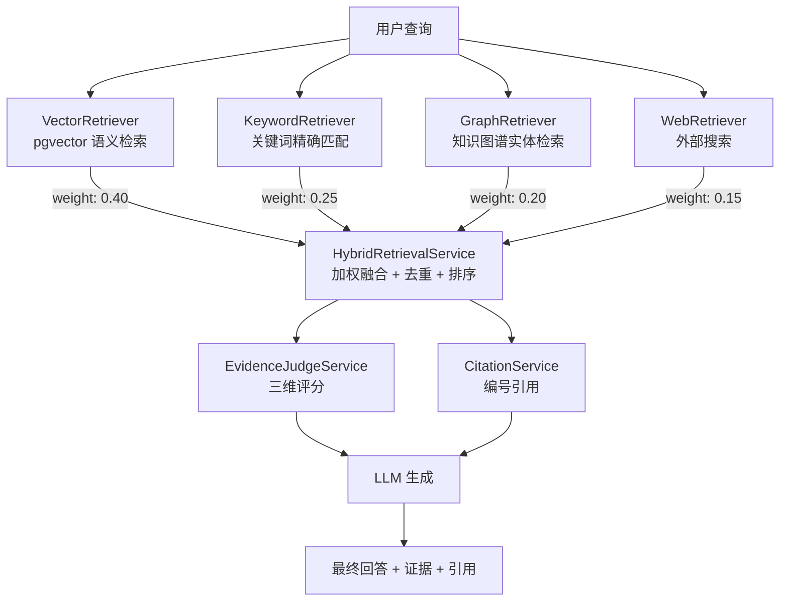

# 混合检索架构

## 四路召回融合



## 容错与故障隔离

四路并行跑在专用线程池（默认 16 线程，`app.retrieval.pool-size` 可配；
**须 ≤ 数据库连接池 `DB_POOL_MAX_SIZE` 默认 20**——vector/keyword/graph
三路均直连数据库，扩线程前先扩连接池），单路预算
`app.retrieval.source-timeout-ms`（默认 3000ms）。五个保证：

1. **超时从任务真正开始执行起算**：排队等待不占用超时预算。超时调度在任务
   被 worker 取出执行时才启动，高并发下第 5 个之后的请求在队列里排队，
   而不是被"从提交起算"的旧语义烧光预算后集体假超时降级成空结果。
   排队时长由 `retrieval.queue.wait{source}` 观测。
2. **超时是真取消**：到点中断运行中的执行线程（HTTP 类 IO 可中断释放）。
   不同于 `completeOnTimeout` 只完成 future 不取消任务：web 路读超时 8s、
   向量路无语句超时，慢依赖在调用方放弃后继续占用线程，一次 pgvector
   抖动就可能拖满整池，后续请求"整池 3 秒超时全空"。
3. **底层超时对齐预算**：web 路连接/读取超时 1s/2.5s < 3s 预算，
   任务总能自行退出，不依赖中断兜底。
4. **队列有界，拒绝可见**：单路队列 `app.retrieval.queue-capacity`（默认 64）。
   池与队列打满时提交被拒（`RejectedExecutionException`），立即降级并计入
   `retrieval.source.requests{outcome=saturated}`——拒绝可观测，不在调用线程
   无限堆积；停机期间同样走该路径（retrieve 返回全路降级而非挂死）。
   worker 收尾是 `catch (Exception)`：停机中断（受检异常）也保证 promise
   被完成，调用线程 `join` 不会永挂。
5. **局部故障显式可见**：按路计数 `retrieval.source.requests{source,
   outcome=success|error|timeout|saturated}`；结果携带 `degradedSources`，
   整体 outcome 标注 `degraded` / `degraded-empty` —— "四路全降级导致的空"
   不会再被当成"知识库为空"。池观测：`retrieval.pool.active` / `retrieval.pool.queued`。
   web 路禁用（`app.web-search.enabled=false`）时短路：不提交任务、不占线程槽、
   不产生按路计数（禁用是配置而非故障）。

## 各检索器说明

### VectorRetriever（语义检索）
- 后端：pgvector + HNSW 索引
- 相似度阈值：0.45
- 过滤条件：`tenant_id`（租户共享知识库；chat_id 不做硬过滤，
  同会话命中的文档获得 +0.05 有界加分，见 ChatScope 软作用域）
- 向量维度：1024（text-embedding-v4）

### KeywordRetriever（关键词检索）
- 独立索引：`retrieval_keyword_chunk` MySQL FULLTEXT（ngram parser），
  入库时与 pgvector 同步写入；文档删除时同步清理
- 检索优先走 MySQL `MATCH ... AGAINST`，独立于 pgvector 可用性；
  V22 前的存量文档暂走旧向量候选池重排，逐步回填
- 候选池：租户级、相似度阈值放开为 0（ACCEPT_ALL）、池扩到 max(topK×4, 40)
  ——嵌入距离远但词面精确命中的文档也能进入候选
- 打分：标题召回分（权重 0.6）+ 内容召回分（权重 0.4），
  分母 = 查询 token 数（查询词有多大比例命中，长文档不被稀释）
- 切词 CJK 感知：中文连续段切字符 2-gram（LexicalMatcher），
  拉丁/数字 token 整体保留——中文查询不再"整句单 token 必空"

### GraphRetriever（图谱检索）
- 实体名/别名搜索
- 一跳邻居关系召回
- 事实三元组（subject-predicate-object）搜索

### WebRetriever（外部搜索）
- 占位实现，DeepResearch 模块中接入真实搜索 API
- 权重最低（0.15），仅在有外部信息需求时启用

## 融合策略

1. **Weighted RRF**：`finalScore = Σ(sourceWeight / (rrfK + rank))`，
   默认 `rrfK=60`；只比较各路排名，不比较不同检索器原始分的量纲
2. **跨路去重**：同内容指纹在多路命中时累计 RRF 分，代表文档保留更高原始检索分
3. **降序排序**：按 RRF finalScore 排序取 topK；不再强制来源轮转配额

## 证据评分

EvidenceJudgeService 对每条证据做三维评分：

| 维度 | 权重 | 评分依据 |
|---|---|---|
| 相关性 (Relevance) | 0.50 | 检索分数 + query-doc 关键词命中（切词 CJK 2-gram） |
| 权威性 (Authority) | 0.30 | 来源类型（graph > vector > keyword > web） |
| 时效性 (Timeliness) | 0.20 | 元数据 `created_at`（入库时写入 epoch 毫秒；<30天: 1.0, 一年以上: 0.5，缺失: 中性 0.70） |

综合评分：`score = relevance × 0.50 + authority × 0.30 + timeliness × 0.20`

**判分结果会被消费**（评审不只喂展示层）：HybridRagAnswerService 按综合分
降序组织生成上下文、剔除低于垃圾线（0.30）的证据、截断到 rerankTopK 条进入
prompt；判分为空或全部低于垃圾线时降级回检索序，评审失效不阻塞管线。

## 引用溯源

CitationService 为每条证据生成编号引用：

```json
{
  "index": 1,
  "sourceType": "vector",
  "title": "enterprise-ai-report.pdf",
  "chunkId": "chunk-3",
  "confidence": 0.86,
  "excerpt": "根据 Gartner 2025 年报告，AI Agent 在企业服务领域的采用率..."
}
```

## API

| 端点 | 说明 |
|---|---|
| `POST /ai/rag/search` | 混合检索问答（返回 answer + evidence + citations） |

## 返回结构

```json
{
  "answer": "根據文檔分析，核心概念包括... [1][2]",
  "citations": [/* CitationItem[] */],
  "evidence": [{
    "sourceType": "vector|keyword|graph|web",
    "title": "...",
    "url": "...",
    "chunkId": "...",
    "score": 0.86,
    "relevanceScore": 0.92,
    "authorityScore": 0.75,
    "timelinessScore": 0.70,
    "reason": "向量语义匹配，相关度92%，权威度75%，时效度70%",
    "snippet": "..."
  }],
  "traceId": "trace-a1b2c3d4",
  "memoryUsed": []
}
```
