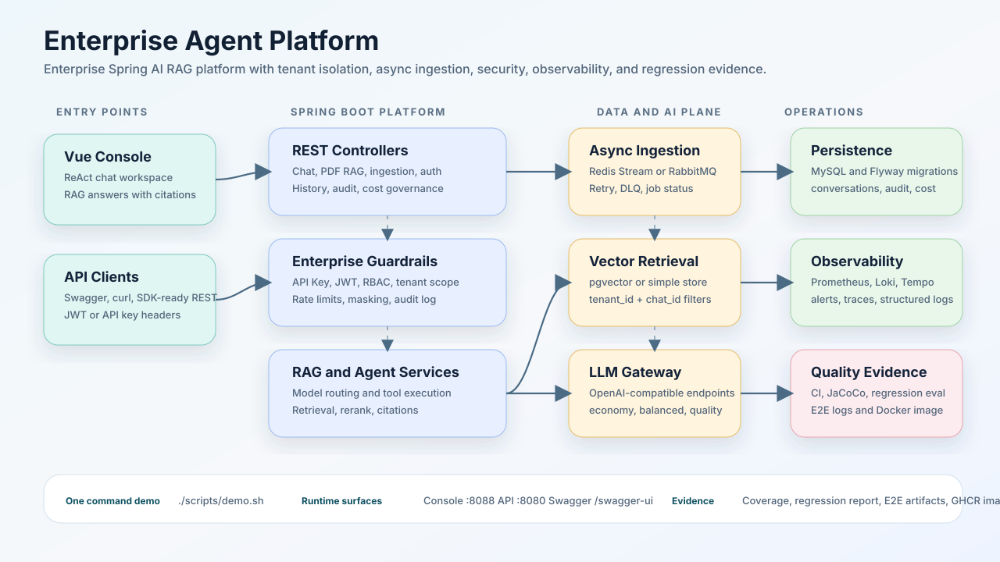
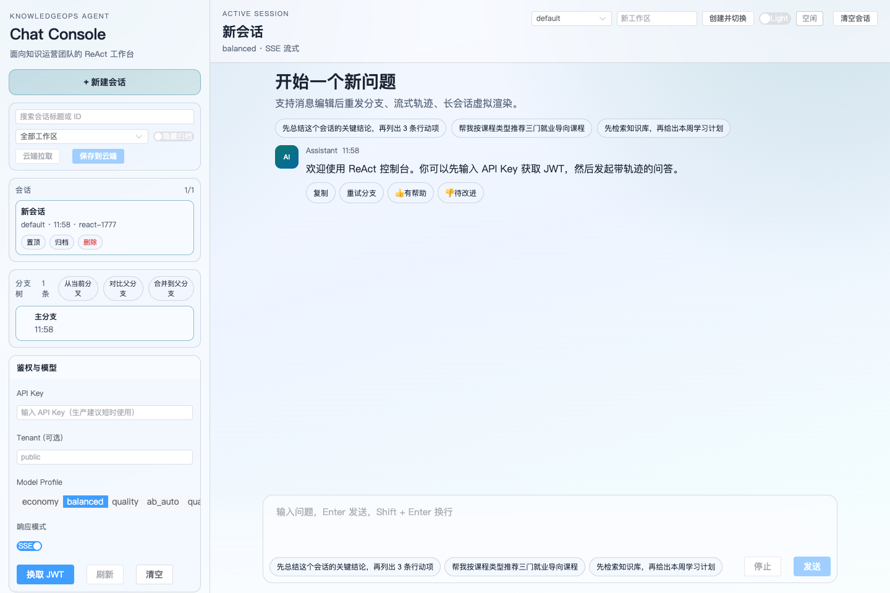
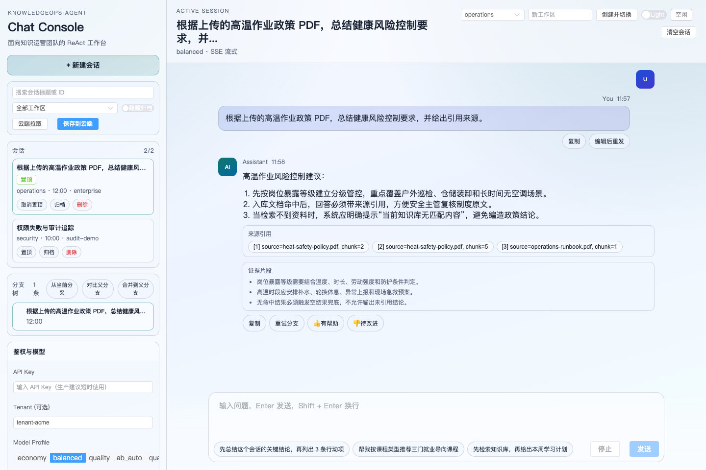

# KnowledgeOps Agent 文档

KnowledgeOps Agent 是一个企业级 Spring AI RAG 平台，覆盖租户隔离检索、异步入库、受治理的 Agent 工作流、可审计的安全体系、生产级可观测性与回归评测。

## 按需选择路径

| 目标 | 从这里开始 | 覆盖内容 |
|---|---|---|
| 本地运行 | [快速上手](getting-started.md) | Docker Compose 启动、健康检查、鉴权 token 流程、环境清理 |
| 走一遍 Demo | [可复现 Demo 脚本](demo-script.md) | Demo 数据、PDF 上传、异步入库、RAG 问答、租户与权限校验 |
| 调用 API | [API 示例](api-recipes.md) | 可直接复制的 curl 示例：chat、RAG、入库、ReAct、可观测 |
| 理解系统架构 | [企业架构](architecture-enterprise.md)、[Agent Harness](architecture-agent-harness.md) | 服务边界、Agent 工具执行、数据流、安全与可观测架构 |
| 部署上线 | [企业部署指南](deployment-enterprise.md) | 生产拓扑、发布检查项、环境变量与发布要点 |
| 日常运维 | [运维手册](operations.md) | 指标、日志、链路追踪、告警、故障演练与回归检查 |
| 跟踪后续规划 | [路线图](roadmap.md) | v1.1.0 重点方向与待办事项 |

## 建议的前 15 分钟上手路径

1. 从 [快速上手](getting-started.md) 开始，运行 `./scripts/demo.sh`。
2. 打开 [可复现 Demo 脚本](demo-script.md)，上传 `demo-data/heat-safety-policy.pdf`。
3. 使用 [API 示例](api-recipes.md)，用演示 API Key 换取 JWT。
4. 依次尝试 `/ai/chat`、`/ingestion/upload/{chatId}`、`/ai/pdf/chat`。
5. 调整数据流或安全边界前，先阅读 [企业架构](architecture-enterprise.md)。
6. 调整队列、向量存储或可观测配置前，先查阅 [运维手册](operations.md)。

## 可视化验证

| 界面 | 预览 |
|---|---|
| 控制台工作区 |  |
| 带引用的 RAG 回答 |  |

## 文档导航

| 分类 | 文档 |
|---|---|
| 项目概览 | [项目 README](https://github.com/however-yir/knowledgeops-agent#readme)、[路线图](roadmap.md) |
| 本地体验 | [快速上手](getting-started.md)、[可复现 Demo 脚本](demo-script.md)、[API 示例](api-recipes.md) |
| 架构与部署 | [企业架构](architecture-enterprise.md)、[Agent 工作流](architecture-agent-workflow.md)、[Agent Harness](architecture-agent-harness.md)、[企业部署指南](deployment-enterprise.md) |
| 运维 | [运维手册](operations.md)、[分布式与可观测演练](drills/distributed-and-observability-drill.md)、[演练模板](drills/runbook_template.md) |
| 技术讲解要点 | [证据清单](talking-points/evidence-checklist.md) |

## 平台能力

| 领域 | 覆盖范围 |
|---|---|
| AI 工作流 | Chat、PDF RAG、ReAct 轨迹、受治理的 agent harness、MCP 适配运行时、trusted workspace 运行时、工具调用、会话历史 |
| 入库 | Redis Stream 或 RabbitMQ 队列、重试、DLQ、幂等、状态追踪 |
| 安全 | API Key、JWT、Refresh Token、RBAC、租户隔离、限流、审计日志 |
| 运维 | Docker Compose、Flyway、Prometheus、Loki、Tempo、Alertmanager、结构化日志 |
| 质量 | CI、单元测试、集成测试、回归评测、k6 压测 |

## 运行时入口

本地容器栈启动后，以下入口可用：

| 界面 | URL |
|---|---|
| 前端控制台 | `http://localhost:8088` |
| 后端 API | `http://localhost:8080` |
| Swagger UI | `http://localhost:8080/swagger-ui/index.html` |
| OpenAPI JSON | `http://localhost:8080/v3/api-docs` |
| 健康检查 | `http://localhost:8080/actuator/health` |
| Prometheus 指标 | `http://localhost:8080/actuator/prometheus` |
| RabbitMQ 控制台 | `http://localhost:15672` |

## 版本与社区

- 最新版本：[v1.0.0](https://github.com/however-yir/knowledgeops-agent/releases/tag/v1.0.0)
- 路线图里程碑：[v1.1.0](https://github.com/however-yir/knowledgeops-agent/milestone/1)
- 讨论区：[GitHub Discussions](https://github.com/however-yir/knowledgeops-agent/discussions)
- 源码仓库：[however-yir/knowledgeops-agent](https://github.com/however-yir/knowledgeops-agent)
